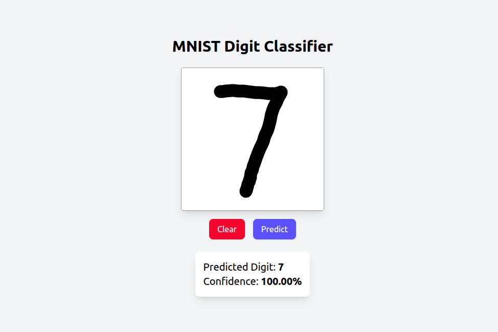

# 🖌️ MNIST Digit Classifier App

This is a full-stack application that predicts handwritten digits (0–9) using a trained **TensorFlow CNN model**.  

## Tech Stack
- **Frontend**: React, Tailwind CSS  
- **Backend**: FastAPI, TensorFlow, NumPy, Pillow  
- **Deployment**: Render.com

## 📸 Screenshot

---
## 🌐 Live Demo
Try here: [MNIST Digit Classifier App](https://mnist-digit-classifier-app.onrender.com/)

